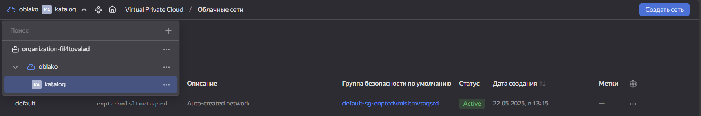
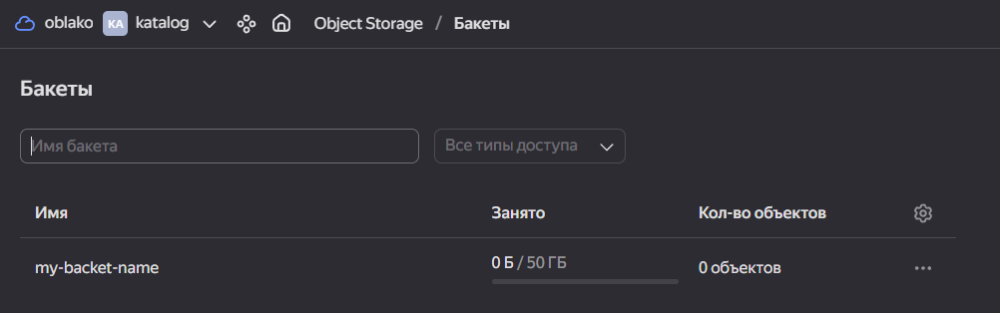

# Yandex Cloud S3 Bucket Terraform Configuration

Проект создает S3-совместимое хранилище в Yandex Cloud с использованием Terraform.

## Структура проекта

Скачана последняя версия Terraform с официального сайта. Он позволяет управлять облаком с помощью текстовых файлов (манифестов), а не через графический интерфейс.

Была создана новая папка для проекта, содержащая файлы:

- main.tf — основной манифест, где описывается, какие ресурсы будут созданы.
- variables.tf — файл, в котором определяются переменные, например, ID облака, каталога и имя бакета.
- terraform.tfvars — файл, в который мы вписываем реальные значения переменных (например, OAuth-токен, ID облака и т.д.) 
- outputs.tf — файл, в котором указываем, какие данные хотим видеть после выполнения команды (например, имя созданного бакета).

Настроен провайдер Yandex Cloud , чтобы Terraform знал, с каким облаком он должен работать. Для этого использовались такие параметры, как OAuth-токен, ID облака и ID каталога.

## Порядок действий

- Чтобы Terraform начал работу, мы запустили команду: terraform init
- Далее: terraform plan - увидели, какие изменения Terraform планирует внести в нашу инфраструктуру. В нашем случае — создание одного бакета
- Когда всё выглядело правильно, мы запустили команду: terraform apply - И ответили yes, чтобы подтвердить выполнение. Terraform начал создавать бакет в Yandex Cloud

После успешного выполнения, бакет был создан, и мы могли увидеть его имя и другие детали в выводе команды.
